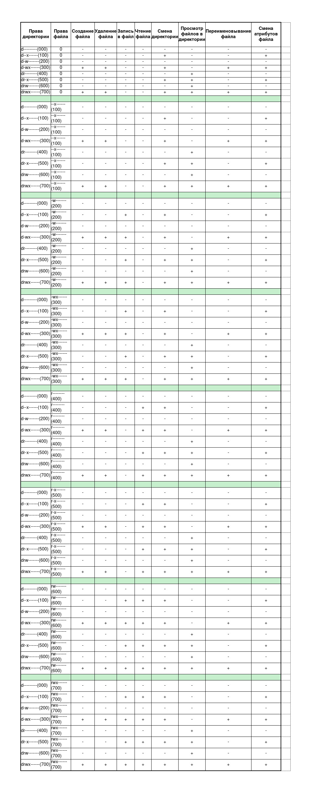

# Лабораторная работа №2
# Дисциплина: информационная безопасность
# Студент: Подорога Виктор Александрович

# Цель работы

Получить практические навыки работы в консоли с атрибутами файлов, закрепить теоретические основы дискреционного разграничения доступа в современных системах с открытым кодом на базе ОС Linux.

# Выполнение лабораторной работы

1. Добавляем гостевого пользователя: 

   

   *Рис. 1. Добавление гостевого пользователя*

2. Настраиваем пароль для гостевого пользователя:

   

   *Рис. 2. Настройка пароля для гостевого пользователя*

3. Заходим в суперпользователя root и проделываем то же самое, чтобы разрешить доступ:

   

   *Рис. 3. Те же действия от root*

4. Заходим в гостевого пользователя:

   

   *Рис. 4. Логин*

5. Командой pwd проверяем путь до директории, в которой оказались:

   

   *Рис. 5. Проверка pwd*

6. Уточняем имя нашего пользователя командой whoami:

   

   *Рис. 6. Уточнение имени пользователя*

7. Уточняем имя нашего пользователя, его группу, а также группы, куда входит пользователь, командой id и groups:

   

   *Рис. 7. Уточнение с помощью id и groups*

   В результате получает одни и те же группы пользователя (в обоих случаях guest)

8. Просмотрим файл /etc/passwd командой cat /etc/passwd:

   

   *Рис. 8.1. Просмотр файла*

   

   *Рис. 8.2. Мой пользователь*

9. Определим существующие в системе директории командой ls -l /home/:

   

   *Рис. 9. Определение существующих в системе директорий*

   Список директорий получен, на директориях установлены права чтения, записи и исполнения, что соответствует атрибуту 700 в таблице.

10. Проверим расширенные атрибуты командой lsattr /home:

    

    *Рис. 10. Проверка расширенных атрибутов*

    Расширенные атрибуты увидеть не удалось - гостевому пользователю отказано в доступе.

11. Создадим в домашней директории поддиректорию dir1 командой mkdir dir1 и определим атрибуты:

    

    *Рис. 11.1. Создание dir1*

    

    *Рис. 11.2. Определение атрибутов*

12. Снимем с директории dir1 все атрибуты командой chmod 000 dir1 и проверим правильность командой ls -l:

    

    *Рис. 12. Снятие всех атрибутов и проверка*

13. Попытаемся создать в директории dir1 файл file1 командой echo "test" > /home/guest/dir1/file1:

    

    *Рис. 13. Попытка создания файла*

    Файл создать не удается, это связано с тем, что у директории dir1 отсутствует право на создание в ней файлов, ее атрибуты 000. 

14. Выполняя команды 14.1 - 14.4, анализируем атрибуты директории и файла в ней:

    

    *Рис. 14.1. Обнуляем права директории*

    

    *Рис. 14.2. Выдаем директории право на исполнение*

    

    *Рис. 14.3. Выдаем директории право на запись*

    

    *Рис. 14.4. Выдаем директории право на исполнение и запись*

    

    *Рис. 14.5. Таблица атрибутов*

# Вывод

В ходе лабораторной работы я получил практические навыки работы с атрибутами файлов и директории с использованием консоли операционной системы CentOS Linux, а также закрепил теоретические основы дискреционного разграничения доступа в современных системах с открытым кодом на базе ОС Linux.