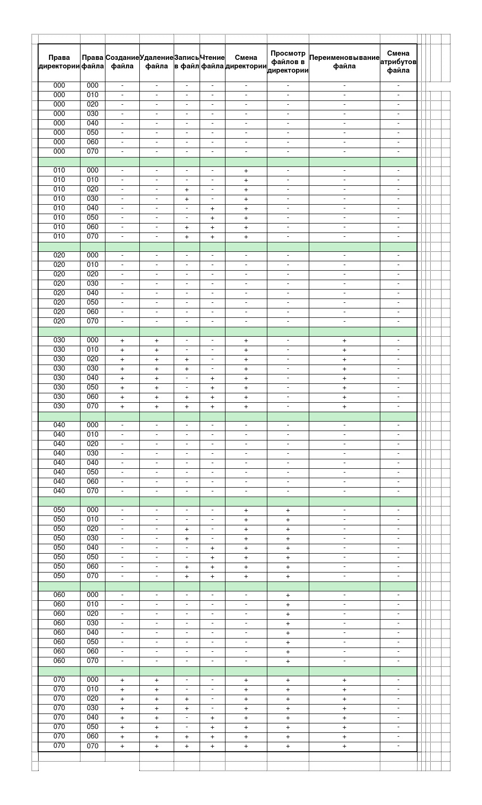

# Лабораторная работа №3
# Дисциплина: информационная безопасность
# Студент: Подорога Виктор Александрович

# Цель работы

Получить практические навыки работы в консоли с атрибутами файлов для групп пользователей.

# Выполнение лабораторной работы

1. Добавляем гостевого пользователя (видно, что он ранее был добавлен в предыдущей работе): 

   

   *Рис. 1. Добавление гостевого пользователя*

2. Настраиваем пароль для гостевого пользователя:

   

   *Рис. 2. Настройка пароля для гостевого пользователя*

3. Заходим в суперпользователя root и проделываем то же самое, чтобы разрешить доступ, а также создаём guest2:

   

   *Рис. 3. Те же действия от root и создание guest2*

4. Добавляем гостевого пользователя в группу guest:

   

   *Рис. 4. Добавление гостевого пользователя в группу guest*

5. В разных терминалах осуществили вход в систему от пользователей guest и guest2:

   

   *Рис. 5. Вход от guest и guest2*

6. Для обоих пользователей командой pwd определили директорию, в которой находимся:

   

   *Рис. 6. Определение директории*

7. Уточняем имя нашего пользователя, его группу, а также группы, куда входит пользователь, командой id и groups:

   

   *Рис. 7.1. Уточнение для guest с помощью id и groups*

   

   *Рис. 7.2. Уточнение для guest2 с помощью id и groups*

   В результате командой groups и id -Gn получаем одинаковый вывод - названия групп пользователей, а id -G получаем число - id группы пользователей.

8. Просмотрим файл /etc/group командой cat /etc/group:

   

   *Рис. 8.1. Просмотр файла*

   

   *Рис. 8.2. Мои пользователи*

9. От имени пользователя guest2 выполним регистрацию пользователя guest2 в группе guest:

   

   *Рис. 9. Регистрация guest2 в guest*

10. От имени пользователя guest изменим права директории /home/guest, разрешив все действия для пользователей группы:

    

    *Рис. 10. Изменение прав директории /home/guest*

    Расширенные атрибуты увидеть не удалось - гостевому пользователю отказано в доступе.

11. От имени пользователя guest снимем с директории /home/guest/dir1 все атрибуты, потом будем менять атрибуты и смотреть, что происходит с доступом:

    

    *Рис. 11.1. Снятие атрибутов с dir1*

    

    *Рис. 11.2. Определение атрибутов*

    

    *Рис. 11.3. Проверка тестовым документом*

    

    *Рис. 11.4. Изменение атрибутов и очередная проверка*

    

    *Рис. 11.5. Изменение атрибутов и очередная проверка*

    

    *Рис. 11.6. Изменение атрибутов и очередная проверка*

    

    *Рис. 11.7. Изменение атрибутов и очередная проверка*

    

    *Рис. 11.8. Изменение атрибутов и очередная проверка*

    

    *Рис. 11.9. Изменение атрибутов и очередная проверка*

    

    *Рис. 11.10. Изменение атрибутов и очередная проверка*

    

    *Рис. 11.11. Таблица атрибутов*

    

    *Рис. 11.12. Таблица минимальных прав*

# Вывод

В ходе лабораторной работы я получил практические навыки работы с атрибутами файлов для групп пользователей в условиях ОС Linux.